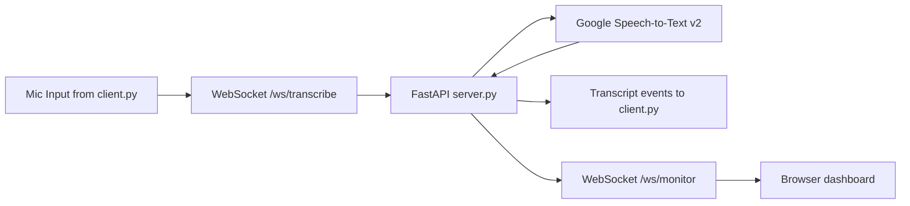

# Realtime Speech-to-Text Demo

This project provides a **working local demo** with:

- a WebSocket transcription server (`server.py`)
- a microphone streaming client (`client.py`)
- a live frontend dashboard (`static/index.html`) with a podcast icon and latency chart

## Architecture



## Requirements

- Python 3.10+
- `GOOGLE_CLOUD_PROJECT` configured
- Google credentials available locally (`GOOGLE_APPLICATION_CREDENTIALS`)
- Linux microphone device available

## Install

```bash
python -m venv venv
source venv/bin/activate
pip install -r requirements.txt
```

If `pyaudio` fails to install on Linux, install PortAudio first:

```bash
sudo apt-get update
sudo apt-get install -y portaudio19-dev
pip install pyaudio
```

## Run

Start server:

```bash
source venv/bin/activate
export GOOGLE_CLOUD_PROJECT="your-project-id"
uvicorn server:app --reload --host 0.0.0.0 --port 8000
```

Start client (new terminal):

```bash
source venv/bin/activate
python client.py --url ws://127.0.0.1:8000/ws/transcribe
```

Open dashboard:

- `http://127.0.0.1:8000`

## Review transcription speed

The dashboard shows:

- live transcript events
- podcast icon pulse when audio is flowing
- latency chart and summary (`avg`, `p50`, `p95`)

CLI metrics snapshot:

```bash
source venv/bin/activate
python latency_report.py
```

## Config

Optional environment variables:

- `GCP_SPEECH_LOCATION` (default: `us-central1`)
- `GCP_SPEECH_MODEL` (default: `chirp`)
- `GCP_SPEECH_LANGUAGE` (default: `en-US`)

If Chirp access is not enabled in your project, try:

- `export GCP_SPEECH_MODEL=long`
