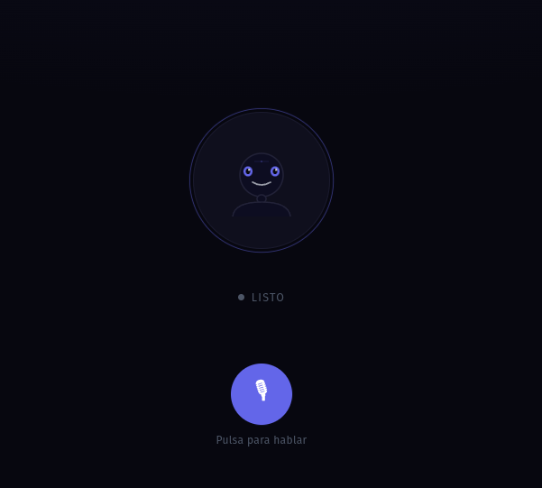

# Real-Time Voice Agent

A production-grade real-time voice agent built on Google Cloud. Streams microphone audio through a cascade pipeline — Speech-to-Text → Gemini LLM → Text-to-Speech — with sub-second end-to-end latency and full barge-in support.


## Pipeline

```text
Microphone ──WebSocket──► [STT: Chirp 3]
                                │  partial / FINAL transcript
                                ▼
                         [Gemini 2.0 Flash]   ← streaming tokens
                                │
                         [Sentence chunker]   ← emit on . ! ?
                                │
                         [TTS: Cloud TTS]     ← synthesize per sentence
                                │
                         ──WebSocket──► Speaker
```

Audio is streamed in real time. The LLM starts generating as soon as the first FINAL transcript arrives (or after a debounce window on partials). TTS synthesis fires sentence by sentence as tokens arrive, so the first audio chunk reaches the client before the LLM finishes the full response.

If the user speaks while the agent is playing (**barge-in**), the client detects the RMS spike, sends an `interrupt` message, and the server cancels the in-flight pipeline immediately.

## Architecture

Hexagonal layout — infrastructure adapters are interchangeable without touching the core pipeline:

```text
gcp_audio/
├── config.py                   # All env-var configuration in one place
├── core/
│   ├── chunker.py              # SentenceChunker — pure domain logic
│   └── pipeline.py             # AgentPipeline — cascade orchestration
├── adapters/
│   ├── gcp_stt.py              # Google Cloud Speech-to-Text v2
│   ├── gemini.py               # Google Gemini (Vertex AI)
│   └── gcp_tts.py              # Google Cloud Text-to-Speech
├── application/
│   ├── metrics.py              # Latency metrics store + monitor hub
│   ├── speech_session.py       # STT-only WebSocket session
│   └── agent_session.py        # Full voice agent WebSocket session
├── api.py                      # FastAPI app and routes
├── server.py                   # Entry point — logging setup + uvicorn
└── client.py                   # CLI test client (microphone + speaker)
```

**Dependency flow:** `api` → `application` → `core` ← `adapters` (adapters are injected into the pipeline at the application layer; `core/` has no Google Cloud imports).

## Key Design Decisions

**Chirp 3 stream restart** — Google's Chirp 3 model closes the gRPC stream after each FINAL result. The worker loop automatically reopens the stream and swaps the audio queue so in-flight audio chunks are not lost and the new stream starts clean.

**Debounce on partials** — a configurable window (`LLM_DEBOUNCE_MS`, default 200 ms) delays pipeline start on partial transcripts. If a FINAL arrives before the debounce fires, the pipeline starts immediately with the complete text.

**Echo suppression** — if TTS audio has already been sent when a new FINAL arrives, that FINAL is treated as microphone echo of the agent's own speech and discarded.

**Generation tokens** — each pipeline run carries a monotonically increasing `gen` counter. Audio callbacks from superseded pipelines are silently dropped, preventing out-of-order audio from stale runs.

## Latency Profile

| Segment | Typical |
|---------|---------|
| Network (client → server) | < 20 ms |
| STT — Chirp 3 FINAL | 100–300 ms |
| LLM first token — Gemini Flash | 200–500 ms |
| TTS first sentence synthesis | 150–400 ms |
| **Total to first audio** | **~600–1 200 ms** |

## Setup

### Prerequisites

- Python 3.10+
- Google Cloud project with the following APIs enabled:
  - Cloud Speech-to-Text v2
  - Vertex AI (Gemini)
  - Cloud Text-to-Speech
- Application Default Credentials configured:

```bash
gcloud auth application-default login
```

### Install

```bash
python -m venv venv
source venv/bin/activate
pip install -r requirements.txt
```

If `pyaudio` fails on Linux, install PortAudio first:

```bash
sudo apt-get install -y portaudio19-dev && pip install pyaudio
```

### Configure

Create a `.env` file in the project root:

```bash
GOOGLE_CLOUD_PROJECT=your-project-id

# Speech-to-Text
SPEECH_LOCATION=eu          # global | eu | us
SPEECH_MODEL=chirp_3        # chirp_3 | latest_short | latest_long
SPEECH_LANGUAGE=es-ES

# Gemini
GEMINI_MODEL=gemini-2.0-flash-001
GEMINI_LOCATION=us-central1

# Text-to-Speech
TTS_VOICE=es-ES-Standard-A

# Tuning
LLM_DEBOUNCE_MS=200         # ms to wait on partial before firing pipeline
BARGE_IN_THRESHOLD=300      # RMS amplitude threshold for barge-in detection
```

## Running

### Server

```bash
# Development
uvicorn api:app --reload

# Production
uvicorn api:app --host 0.0.0.0 --port 8000
```

The live dashboard is available at `http://localhost:8000` with latency charts and transcript feed.

### CLI Client

```bash
# STT-only mode — transcription with latency breakdown
python client.py

# Full voice agent mode — microphone in, speaker out
python client.py --agent
```

## WebSocket Protocol

### `/ws/agent`

#### Client → Server

| Message | Fields | Description |
| --- | --- | --- |
| `audio` | `audio_b64`, `sent_at_ms`, `seq` | Raw PCM, 16 kHz mono, base64-encoded |
| `interrupt` | — | Cancel current agent response (barge-in) |
| `stop` | — | End session |

#### Server → Client

| Message | Fields | Description |
| --- | --- | --- |
| `agent_start` | — | Agent is about to speak |
| `audio_chunk` | `audio_b64`, `sample_rate` | Raw PCM chunk to play |
| `agent_done` | `latency` | Response complete; includes `stt_ms`, `llm_first_token_ms`, `tts_first_audio_ms`, `total_ms` |
| `agent_interrupted` | — | Pipeline cancelled by barge-in |
| `agent_error` | `message` | Pipeline error |

### `/ws/transcribe`

STT-only mode. Accepts the same `audio` messages and emits `transcript` events with `is_final`, `latency_ms`, and a full latency breakdown per segment.

## Extending

Swap any adapter without touching the core pipeline:

- **Different STT provider**: replace `adapters/gcp_stt.py` — implement `SttStream` with `.push()`, `.requests()`, and `.swap_queue()`
- **Different LLM**: replace `adapters/gemini.py` — implement `stream_response(conversation, user_text, on_token, cancel_flag)`
- **Different TTS**: replace `adapters/gcp_tts.py` — implement `synthesize(text) -> bytes`

## Why This Repo

- **Realtime first**: designed for low-latency speech UX, not offline batch processing.
- **Barge-in ready**: interruption handling is a first-class flow, not an afterthought.
- **Provider-agnostic core**: domain pipeline remains isolated from cloud adapters.
- **Observable behavior**: live metrics, transcript events, and rotating server logs.

## Quality Signals

- Unit tests are available under `tests/`.
- CI runs automated tests on pull requests and pushes to `main`.
- Dependency updates are automated with Dependabot.
- Security reports are handled via `SECURITY.md`.

## Contributing

Contributions are welcome.

- Start with `CONTRIBUTING.md` for local setup and PR rules.
- Use issue templates for bug reports and feature requests.
- Keep PRs focused and include test evidence.

## Roadmap

See `ROADMAP.md` for near-term priorities and milestone candidates.

## Deployment

### Docker (local or any container platform)

```bash
docker build -t gcp-audio-agent .
docker run --rm -p 8000:8000 --env-file .env gcp-audio-agent
```

### Google Cloud Run

```bash
gcloud run deploy gcp-audio-agent \
       --source . \
       --region us-central1 \
       --allow-unauthenticated
```

Set required env vars (`GOOGLE_CLOUD_PROJECT`, speech/gemini/tts settings)
in the Cloud Run service configuration.
